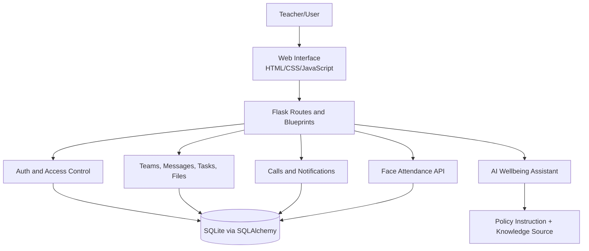
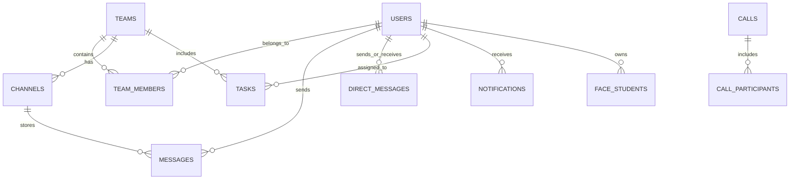
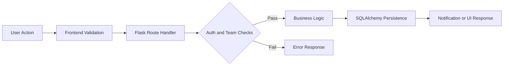
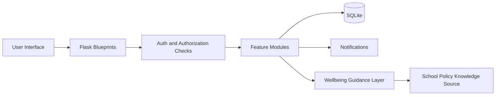
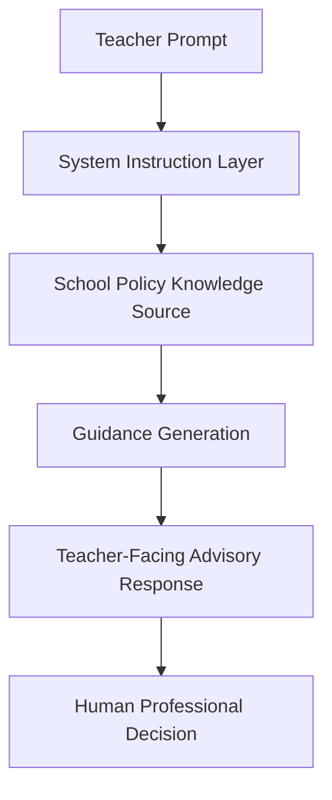

# Final Year Project Report Draft

## Working Title
Teacher Feature Hub: A Unified Digital Platform for Attendance, Wellbeing Support, and Institutional Communication

## Project Title Page

Project Title: Teacher Feature Hub: A Unified Digital Platform for Attendance, Wellbeing Support, and Institutional Communication

Student Name: Aftab Khan

Student Number: [Insert Student Number]

Supervisor Name: [Insert Supervisor Name]

Degree: BSc Computer Science

Module: 6COSC023W Final Year Project

University: University of Westminster

School: School of Computer Science and Engineering

Submission Date: 14 June 2026

## Document Scope

This report documents the design, implementation, and evaluation of Teacher Feature Hub, a unified educational platform combining institutional communication, facial-recognition attendance support, and AI-guided wellbeing assistance for teachers. The scope includes architecture decisions, implementation details, testing approach, legal/ethical analysis, and reflective evaluation against project objectives. The report focuses on the actual implemented system and its practical behaviour in final-year project conditions.

Out of scope items include full enterprise deployment architecture, large-scale production benchmarking, complete automated testing infrastructure, and formal institutional governance rollout (for example full policy ratification workflows, legal sign-off, and operational compliance deployment). These are treated as future development requirements rather than completed deliverables.

## Declaration

I declare that this report is my own work and that all sources used have been acknowledged using Harvard referencing.

Name: Aftab Khan

Submission Date: 14 June 2026

Word Count: 15,264 (recalculated from current draft file)

## Abstract

Educational institutions increasingly depend on digital systems for communication, attendance management, and student support, yet these workflows are often delivered through separate tools. This fragmentation can increase teacher workload, reduce operational continuity, and weaken institutional control over data and decision context. This project addresses that problem through Teacher Feature Hub, a unified platform designed to bring three critical functions into one operational environment: an internal collaboration system, a facial-recognition attendance module, and an AI wellbeing assistant for teacher guidance.

The project was implemented as a full-stack web platform using Python Flask, SQLAlchemy, SQLite, server-rendered templates, and targeted JavaScript interactivity. The architecture uses modular route design through blueprints, relationship-based data modelling, and session-based authentication with role-aware access checks. Core collaboration functionality includes user authentication, team and channel management, direct messaging, file sharing, task management, notifications, and real-time calling workflows. Call support integrates route-level lifecycle control with Socket.IO/WebRTC signalling and includes transcript/summary-linked records.

A key implementation focus was integration quality across modules. Rather than building isolated feature pages, the system links communication, attendance, and wellbeing support in one authenticated flow. The attendance module was enhanced from browser-only behaviour to backend persistence using dedicated synchronization endpoints and database storage, improving reliability across sessions. The wellbeing feature is currently integrated as an embedded external chatbot page within the same platform navigation.

Testing followed an iterative, scenario-based methodology embedded into development cycles, combining black-box scenario validation from a user perspective with white-box checks of internal authorization logic and route-level controls. Coverage prioritized high-risk paths, including authentication boundaries, authorization checks, messaging integrity, notification routing, attendance persistence, and call state transitions. Policy-alignment behaviour was also tested in the wellbeing assistant to ensure responses remained advisory and teacher-centred. Each test case was mapped to a declared functional requirement, providing systematic traceability between test coverage and project objectives. Findings indicate strong functional coherence and practical usability in expected project conditions.

Critical evaluation identifies clear strengths and limitations. Strengths include modular architecture, integrated workflow design, advisory wellbeing integration, and maintainable implementation choices suitable for final-year scope. Limitations include constrained scale readiness (SQLite and mesh call topology), limited automated regression depth, and incomplete large-sample fairness benchmarking for attendance recognition.

Overall, the project demonstrates that a unified teacher-centred platform can improve workflow continuity and institutional control while remaining realistic for academic implementation constraints. Teacher Feature Hub provides a functional prototype with clear educational relevance, traceable design decisions, and a credible foundation for future production-oriented enhancement. Future priorities include automated regression testing, stronger governance tooling for sensitive data modules, scalable media infrastructure for larger group calls, and extended fairness benchmarking for the attendance recognition component.

Word Count: 540

## Acknowledgements

I would like to thank my project supervisor for guidance and feedback throughout the development and writing process. I also appreciate the support of peers who provided practical feedback during feature testing and usability checks. Finally, I acknowledge the University of Westminster for providing the academic structure and resources needed to complete this final-year project.

## Table of Contents

1. Introduction
1.1 Problem Statement
1.2 Aims and Objectives

2. Background
2.1 Literature Survey
2.2 Review of Existing Projects/Applications
2.3 Review of Tools, Frameworks and Techniques

3. Legal, Social, Ethical and Sustainability Issues

4. Methodology

5. Design

6. Tools and Implementation
6.1 Tools
6.2 Implementation

7. Testing
7.1 Test Coverage
7.2 Test Methodology
7.3 Performance Analysis and Optimization

8. Conclusions and Reflections

9. References

10. Bibliography

11. Appendix

## List of Figures

Figure 1: System architecture and module boundaries

Figure 2: Simplified ER view of key platform entities

Figure 3: Common request-to-response data flow in core features

Figure 4: Implementation-level component interaction

Figure 5: Wellbeing guidance boundary with human decision endpoint

Figure 7: Performance Improvement Analysis - Phase 2 Optimization Results (Before/After Comparison)

## List of Tables

Table 1: Comparative overview of existing platforms and Teacher Feature Hub

Table 2: Functional requirements mapping

Table 3: Core database entities and relationships

Table 4: Security controls implemented

Table 5: Testing coverage matrix

Table 6: Project objectives vs achieved outcomes

Table 7: Performance benchmark means from repository artifact output

## 1. Introduction

### 1.1 Problem Statement

Educational institutions now rely on digital systems for almost every daily activity, yet many teachers still work across disconnected tools for communication, attendance, and student support. In practice, this fragmentation creates operational friction. A teacher may need one platform for class communication, another system for attendance records, and separate informal channels for pastoral or wellbeing concerns. This fragmented workflow increases time spent switching contexts, weakens visibility of student patterns, and creates inconsistent data ownership. In many schools and universities, the result is not only inefficiency but also delayed decisions, duplicated effort, and reduced confidence in the reliability of records.

The core problem addressed in this project is therefore not the absence of digital tools, but the absence of integration between critical teaching workflows. Attendance systems can be vulnerable to proxy behaviour when identity checks are weak. Communication tools are often externally hosted, which can reduce institutional control over data and long-term platform direction. Wellbeing support is frequently handled through ad hoc judgement under time pressure, with limited structured guidance available to teachers at the point of need. When these gaps are combined, the institution faces a wider governance problem: important educational decisions are being made using fragmented, partially connected evidence.

Teacher Feature Hub was designed to respond to this exact problem through a unified platform containing three core components: an AI wellbeing assistant, a facial-recognition attendance module, and an internal collaboration environment inspired by familiar team communication systems. The intended value is practical: reduce tool switching, improve traceability of actions, and strengthen confidence in attendance and communication records while keeping teacher decision-making central. In the wellbeing component specifically, the AI feature is positioned as guidance rather than replacement. This distinction is important because safeguarding and student support require human responsibility, contextual understanding, and professional accountability.

From a technical and project-management perspective, the problem statement also reflects realistic constraints of a final-year implementation. The platform had to be robust enough to demonstrate full-stack engineering decisions, security controls, and multi-feature integration, but still achievable within university timelines and resources. For this reason, the system uses a Flask-based architecture with modular routes, SQLite persistence, and focused feature delivery rather than enterprise-scale infrastructure. This approach prioritises clarity, maintainability, and demonstrable functionality.

Overall, the project addresses a real educational systems challenge: how to give teachers a single operational environment that combines communication, attendance integrity, and informed wellbeing support without overcomplicating deployment. The evaluation focus is therefore not whether each component can match specialist commercial products in depth, but whether the integrated design meaningfully improves institutional control, workflow efficiency, and decision support in a realistic academic prototype.

During development, I found that this problem definition was useful as a practical decision filter. When a feature idea looked interesting but did not clearly reduce fragmentation or improve teacher decision continuity, it was deprioritised. This directly supports the objective of building a coherent platform rather than a feature-heavy but disconnected system.

Word Count: 517

### 1.2 Aims and Objectives

The main aim of this project is to design and implement a unified digital platform that supports teachers in three operationally linked areas: communication, attendance integrity, and wellbeing-informed decision support. Instead of treating these as isolated technical problems, Teacher Feature Hub treats them as connected institutional workflows. The intention is to reduce friction in day-to-day academic operations while also improving data visibility, accountability, and control inside the institution.

To achieve this aim, the first objective was to build a secure user and team collaboration foundation using a Flask web architecture, role-aware access control, and persistent data models for users, teams, channels, messages, notifications, files, and tasks. This objective was prioritised first because the communication layer acts as the operational core of the whole system. Without reliable identity management and structured collaboration spaces, the attendance and wellbeing components would remain disconnected utilities rather than part of one platform.

The second objective was to implement a facial-recognition attendance workflow that reduces opportunities for proxy attendance while maintaining usable classroom operation. In this project scope, that objective focused on camera-based matching, class-level student grouping, and backend persistence of face attendance records through synchronized API routes. The design choice was to prioritise practical demonstration and data continuity over enterprise-grade biometric infrastructure, which would have required broader hardware, policy, and legal implementation beyond final-year constraints.

The third objective was to integrate an AI wellbeing support feature that provides teacher-facing guidance rather than autonomous decisions. This objective is deliberately human-centred: the system is designed to assist teachers with structured suggestions in sensitive situations, while responsibility remains with human professionals. This approach was selected to reflect ethical and safeguarding realities in educational contexts.

A final cross-cutting objective was maintainability and demonstrable extensibility, achieved through modular blueprints, clear route separation, and incremental implementation. The key trade-off is that some advanced capabilities remain limited compared to specialised commercial systems. However, against the project aims, the implemented objectives provide a coherent and realistic integrated prototype that demonstrates technical competence and practical educational value.

An alternative approach would have been to prioritize one advanced component, such as a more complex AI assistant, and reduce collaboration scope. I deliberately avoided that route because it would weaken the core objective of integration. In other words, breadth with architectural coherence was more aligned with the dissertation goals than depth in a single isolated feature.

Word Count: 329

## 2. Background

### 2.1 Literature Survey

Educational technology research generally agrees that digital systems have improved access and continuity, but they have also introduced new operational pressures for teachers. Much of the literature focuses on learner outcomes, while practical staff workflows receive less attention. In schools and universities, teachers frequently coordinate communication, attendance, safeguarding signals, and administrative follow-up through separate systems (Selwyn, 2016; Holmes, Bialik and Fadel, 2019). This distinction is central to this project, because the problem is not the lack of software but the fragmentation of software.

Workload studies reinforce this point. Evidence suggests that context switching, repeated data entry, and duplicated communication increase operational stress when tools are not interoperable (OECD, 2020). In design terms, this means efficiency is not only about adding features; it is about reducing workflow breaks. That argument directly supports the integrated direction of Teacher Feature Hub, where communication, attendance, and wellbeing guidance are brought into one platform to improve continuity in daily practice.

The wellbeing component is informed by literature on AI-assisted educational support. A common position is that AI should augment, not replace, professional judgement in sensitive environments (Luckin et al., 2016; UNESCO, 2021). Research on responsible AI also highlights risks of over-reliance, biased outputs, and limited transparency in model behaviour (Floridi et al., 2018). These concerns justify this project's human-in-the-loop approach: the AI wellbeing assistant is advisory, and teachers remain accountable for final decisions.

Related mental-health technology literature reaches a similar conclusion. Digital tools can improve consistency and early guidance, but they are not substitutes for institutional safeguarding structures, counselling expertise, or contextual professional judgement (Bakker, Kazantzis, Rickwood and Rickard, 2016). This is why the wellbeing function in this implementation is deliberately framed as support for teacher reasoning rather than diagnosis or automated intervention.

A second major literature stream concerns face recognition attendance. Studies report benefits such as lower impersonation risk and faster registration in large cohorts compared with manual or card-based systems (Samet and Tanriverdi, 2017). However, published evaluations also identify limitations: lighting variation, pose changes, occlusion, camera quality, and demographic performance gaps can affect reliability (Buolamwini and Gebru, 2018; Wang and Deng, 2021). These findings matter in education because attendance records have disciplinary and safeguarding consequences. A technically convenient system is not acceptable if it introduces fairness concerns.

Privacy and governance literature adds another layer of evaluation. Biometric data is highly sensitive, and scholarship plus regulatory guidance emphasise data minimisation, explicit purpose limitation, access control, and lawful processing under frameworks such as GDPR (ICO, 2023). This supports a cautious interpretation of this project's attendance module: it demonstrates anti-proxy intent and persistent record handling, but full production deployment would require stronger policy controls, explicit institutional governance, and formal impact assessment.

The third relevant stream covers internal communication platforms. Enterprise and education studies suggest integrated messaging, file sharing, and task tracking improve coordination speed and visibility (Treem and Leonardi, 2012). At the same time, critical literature warns of platform dependence, data lock-in, and reduced institutional autonomy when key communication functions are fully outsourced (Williamson, Bayne and Shay, 2020). This tension helps justify the communication architecture in this project, which prioritises local control and a tailored education context while preserving familiar collaboration patterns.

Finally, software engineering literature for student-scale systems supports modular and incremental development as a practical strategy for quality under constrained resources (Pressman and Maxim, 2019). This aligns with the implemented Flask blueprint structure and iterative feature expansion shown throughout the project logs. The strength of this approach is maintainability and explainability; the limitation is reduced breadth compared with large enterprise stacks.

Overall, the literature reveals a clear gap at undergraduate prototype level: communication, wellbeing guidance, and biometric attendance are often studied separately, but rarely designed as one teacher-centred operational system. Teacher Feature Hub addresses that gap by integrating all three while keeping ethical boundaries explicit. The survey therefore justifies both the project's aim and its implementation choices: a practical, maintainable, human-centred platform that improves continuity and institutional control without claiming to replace specialist professional judgement.

This literature position also guided scope control. I chose to treat integration quality as the primary research contribution, rather than claiming state-of-the-art performance in any one component. That trade-off strengthens academic honesty and keeps the project evaluation aligned with what was actually implemented.

Word Count: 835

### 2.2 Review of Existing Projects/Applications

The current educational technology landscape includes several mature platforms that solve important parts of institutional digital operations, but most do so within specific functional boundaries. This matters for the present project because Teacher Feature Hub was not created in a vacuum; it was designed in response to both the strengths and limitations of widely used systems. Reviewing existing applications helps position the project realistically and explains why an integrated architecture was prioritised.

Microsoft Teams is one of the most visible reference systems for institutional communication and collaboration. Its strengths are clear: persistent channels, direct messaging, file sharing through integrated cloud services, and support for calls and meetings in one interface. In education use, Teams also offers classroom-oriented workflows and strong cross-device support. These features influenced the communication model of this project, especially the emphasis on team spaces, channels, notifications, and direct messaging. However, a key limitation from an institutional control perspective is dependency on a broader vendor ecosystem, including licensing, cloud architecture choices, and external service coupling. For institutions seeking tighter local control or low-cost deployability, this can be restrictive.

Google Classroom and associated Google Workspace tools provide another strong model, especially for assignment distribution, announcements, and course administration. Classroom is effective for teaching workflow simplicity, and its integration with Google Drive and Docs supports familiar educational use cases. The limitation is that communication, tasking, and identity workflows are designed around the Google ecosystem. This can be efficient where that ecosystem is already standard, but less flexible for institutions wanting a self-managed stack or custom feature blending, such as combining attendance biometrics and wellbeing guidance inside one local platform.

Moodle, by contrast, represents a highly established open-source virtual learning environment. Its strengths include extensibility, assessment modules, plugin architecture, and strong academic use history. Moodle is particularly strong for content delivery and formal learning management. Its limitations in day-to-day collaboration are mainly usability and interaction style compared with modern chat-centric platforms. Real-time communication, lightweight team interaction, and integrated social collaboration often depend on added plugins or external tools. This separation reinforces the same fragmentation issue identified in the problem statement: course management may be robust, but staff and student interaction workflows can still be distributed across several systems.

When attendance-specific tools are reviewed, many products focus on one mechanism at a time: QR codes, RFID cards, GPS check-ins, or facial recognition. QR and card methods are simple and scalable but remain vulnerable to proxy attendance, especially when identity verification is indirect. Face-recognition attendance applications offer stronger identity binding, but often provide narrow functionality beyond registration logs. In many cases, attendance systems are not deeply connected to communication or student support workflows, meaning teachers still need to manually bridge gaps across tools. This is where Teacher Feature Hub differs: attendance is treated as one component within a wider operational environment rather than a standalone endpoint.

Wellbeing applications and mental-health chat tools provide another relevant comparison. Many digital wellbeing systems target student self-service support, symptom checklists, or basic triage conversations. These can provide value, but they are not always designed for teacher-facing decision support during classroom or pastoral situations. In addition, standalone wellbeing apps may create governance challenges when records and communication are separated from institutional systems. Teacher Feature Hub takes a different direction by embedding a wellbeing assistant in the same platform as communication and attendance context, while maintaining a clear advisory boundary and human-led judgement.

Open-source team collaboration projects also offer useful reference points. Platforms such as Mattermost or Rocket.Chat demonstrate that institution-controlled messaging systems are viable alternatives to fully outsourced enterprise SaaS. Their strengths are data control and custom deployment. Their limitations for this project's context are integration overhead, feature tailoring effort, and complexity for a final-year implementation scope. Instead of adopting a large external collaboration codebase, this project implements a focused collaboration core directly in Flask to keep architecture explainable and demonstrable for academic assessment.

A critical comparison across these applications shows a repeated pattern: specialist tools usually do one thing well, but educational operations need cross-feature continuity. Commercial suites provide broad coverage but can introduce dependency and reduced local flexibility. Open-source ecosystems provide control but can demand substantial integration effort. Teacher Feature Hub positions itself between these extremes. It does not attempt to outperform enterprise products feature-for-feature; instead, it demonstrates a coherent integrated baseline where communication, attendance integrity, and wellbeing support are operationally connected in one manageable system.

This comparative review also reveals where existing platforms remain stronger than the current implementation. Mature systems have deeper analytics, higher scalability, richer admin governance, and larger ecosystem integrations. They also typically include advanced monitoring and compliance tooling. These are acknowledged limitations of an undergraduate prototype. At the same time, this project's comparative advantage is educational alignment and transparency: architecture and decisions are tailored to local institutional priorities, and each core feature can be explained, modified, and evaluated without opaque vendor constraints.

Overall, existing applications informed both the feature set and the boundaries of this project. From Teams and Classroom, the project adopts collaboration-first usability principles. From Moodle and open-source platforms, it takes the importance of ownership and adaptability. From attendance and wellbeing tools, it adopts targeted capability while avoiding isolated deployment. The resulting design choice is justified: a unified platform that reduces fragmentation and improves practical workflow continuity, while openly recognising that production-scale depth would require further development beyond final-year scope.

From a critical perspective, this comparison also highlighted a key limitation in my implementation: platform maturity features such as large-scale analytics and advanced policy automation are still basic. However, this directly reflects a conscious decision to prioritize objective alignment and reliability of core workflows over broad but shallow feature expansion.

Table 1 below summarises the key dimensions across the platforms reviewed and positions Teacher Feature Hub against them. This demonstrates that no single existing solution addresses all three institutional workflow areas within one locally controlled environment, which directly justifies the integrated design direction taken in this project.

| Core Operational Dimension | Microsoft Teams | Google Classroom | Moodle | Teacher Feature Hub (My Solution) |
| :--- | :---: | :---: | :---: | :---: |
| Native Biometric Attendance Tracking | NO | NO | NO | **YES** |
| Embedded AI Wellbeing Assistant | NO | NO | NO | **YES** |
| Local Institutional Data Control | NO | NO | YES | **YES** |
| Integrated Task & File Workspace | YES | YES | YES | **YES** |
| Real-Time Synchronous Calling | YES | NO | NO | **YES** |

Table 1A: Technical gap analysis matrix across core operational dimensions.

| Platform | Communication Integration | Attendance Tracking | Wellbeing Support | Data Control | Integration Level |
|---|---|---|---|---|---|
| Microsoft Teams | Full (channels, DM, calls, files) | None natively | None natively | Low (vendor-managed cloud) | High within vendor ecosystem |
| Google Classroom | Partial (announcements, email-based) | None natively | None natively | Low (Google ecosystem) | High within Google ecosystem |
| Moodle | Limited (forums, plugin-dependent) | Plugin-dependent only | None natively | High (self-hosted) | Moderate with added plugins |
| Standalone attendance tools | None | Narrow (single mechanism only) | None | Variable | Low (isolated standalone) |
| Teacher Feature Hub | Full (channels, DM, calls, tasks, files, notifications) | Face-recognition with backend persistence | Embedded AI advisory assistant (externally hosted runtime) | High (local core platform control) | High (all three domains unified) |

Table 1: Comparative overview of existing platforms and Teacher Feature Hub across key institutional workflow dimensions.

Table 2 maps the declared functional requirements to implemented feature coverage and verification IDs already used in Section 7.

| Functional Requirement | Implemented Feature Coverage | Verification Test IDs |
|---|---|---|
| FR1 | Secure registration, login, and authenticated route access | T01, T02, T03, T04, T05, T06 |
| FR2 | Team creation, invite-code join workflow, and role-aware membership | T07, T08, T09 |
| FR3 | Channel and direct messaging with ownership controls | T10, T11, T12, T13, T14 |
| FR4 | Mention-triggered notifications with deep-link destinations | T15, T16 |
| FR5 | Team file workflow and task management lifecycle | T17, T18, T19, T20 |
| FR6 | One-to-one and group call lifecycle support | T21, T22 |
| FR7 | Facial-attendance sync and persistence workflow | T23, T24, T25 |
| FR8 | Integrated advisory wellbeing assistant page with explicit human-decision boundary | Manual exploratory checks (not automated in this pass) |

Table 2: Functional requirements mapping.

Word Count: 910

### 2.3 Review of Tools, Frameworks and Techniques

The selection of tools and frameworks in this project was guided by three priorities: maintainability, explainability, and realistic delivery within a final-year timeline. Instead of pursuing the most feature-rich stack, the project uses a focused architecture built around Flask, SQLite, SQLAlchemy, Jinja templates, and vanilla JavaScript. This choice reflects a clear methodological position: a well-structured and secure implementation with demonstrable reasoning is academically stronger than an over-complex stack that is difficult to justify or maintain.

Flask was selected as the backend framework because it offers lightweight control of routing and application structure while still supporting modular design through blueprints. In this project, that modularity is visible in route separation for authentication, teams, messaging, calls, dashboard flows, files, tasks, hub integration, and face-attendance persistence. Compared with larger frameworks such as Django, Flask reduces abstraction overhead and allows direct understanding of request handling and control flow, which is useful for viva explanation and iterative implementation. The trade-off is that more conventions must be implemented manually, including some architectural discipline and route-level consistency. For this project scope, that trade-off was acceptable and beneficial.

SQLite was used as the persistence layer, integrated through SQLAlchemy ORM. SQLite provides a low-friction local database suitable for prototype and educational development, with no separate server setup. SQLAlchemy adds type-safe model definitions, relationship management, and query abstraction that reduces direct SQL error risk and improves readability. Together, these tools support rapid implementation and clear data modelling across users, teams, channels, messages, tasks, notifications, calls, and attendance records. The limitation is scalability: SQLite is not designed for high-concurrency institutional production at large scale. However, for an undergraduate system focused on architectural coherence and feature validation, it offers an appropriate balance of simplicity and reliability.

Authentication and session management techniques were implemented with Flask-Login and secure password hashing through Werkzeug utilities. This combination supports core security expectations in web systems: authenticated sessions, user loading, and one-way password hashing rather than plaintext storage. The project also uses form handling and validation patterns that align with secure coding practice, including access checks before protected operations and route-level authorization logic. Alternative approaches, such as custom-built authentication logic from scratch, were intentionally avoided because they increase security risk and reduce maintainability.

On the frontend, Jinja template rendering and vanilla HTML/CSS/JavaScript were selected instead of a single-page framework. The primary justification is project fit: server-rendered templates provide clear page flows and straightforward debugging while still allowing interactive features through targeted JavaScript. This approach also keeps the codebase accessible for academic demonstration, where examiners may ask for direct explanation of page logic, form submission routes, and template inheritance. Compared with React or Next.js, this architecture is less dynamic at scale and offers fewer built-in state-management patterns, but it significantly reduces build complexity and framework overhead.

For real-time communication and calls, the project uses Socket.IO alongside WebRTC techniques. WebRTC enables peer-to-peer media exchange, while Socket.IO handles signalling events such as offer, answer, and ICE candidate exchange. This combination is widely used in practical call systems and is suitable for demonstrating real-time networking concepts in a manageable implementation. The key limitation is that peer-to-peer mesh performance degrades as participant numbers grow, and production-scale systems often require SFU/MCU media infrastructure. That limitation is acknowledged and kept within prototype boundaries.

The facial attendance feature uses browser-based face processing and a backend synchronization endpoint to persist student records per user context. Technically, this hybrid method combines client-side recognition flow with server-side data continuity, addressing one common weakness of browser-only prototypes where data is lost between sessions. An alternative design would be full server-side biometric processing, but this would increase infrastructure complexity and data governance burden significantly for a final-year build. The implemented technique therefore prioritises demonstrable anti-proxy intent, usability, and persistence while keeping deployment manageable.

For AI wellbeing support, the project applies a guidance-oriented assistant model rather than autonomous decision automation. This is a technique choice as much as an ethical one: outputs are framed as recommendations for teachers, not binding outcomes. In tool terms, the emphasis is on integrated interaction design and context-sensitive support rather than advanced model engineering. A more complex approach, such as fine-tuned institutional models with confidence scoring and policy orchestration, could be explored in future work but was outside current constraints. The chosen approach keeps the feature practical and defensible for educational safeguarding contexts.

Comparing alternatives across the stack clarifies the rationale. Django could have accelerated admin features and conventions but would add framework depth not strictly required for this architecture. React-based frontends could improve rich interactivity but introduce additional tooling and state-management complexity. Cloud-hosted managed databases could improve scale readiness but reduce local portability and increase dependency. By contrast, the selected Flask-SQLite-vanilla stack supports the project's primary goals: integrated functionality, clear architecture, secure foundations, and explainable implementation decisions.

Overall, the reviewed tools and techniques are coherent with both the project scope and academic expectations. They provide enough capability to deliver multi-feature integration across communication, attendance, and wellbeing support while keeping the system understandable and maintainable. The main strengths are clarity, modularity, and low setup overhead. The main limitations are enterprise-scale performance and advanced feature depth. As a final-year project, this is a justified and effective balance, demonstrating strong engineering judgement rather than unnecessary technical complexity.

During implementation, this balance proved important in practice: when integration issues appeared, the simpler stack reduced debugging time and made root-cause analysis manageable. This directly supported the objective of maintainability and helped keep iteration cycles short enough to validate improvements before moving to the next feature.

Word Count: 838

## 3. Legal, Social, Ethical and Sustainability Issues

Teacher Feature Hub combines communication data, attendance records, and wellbeing-related interactions, so legal and ethical governance is a core design requirement. The main legal issue is data protection, especially where identifiable student and staff data is processed. Under UK GDPR principles, institutions need lawful basis, purpose limitation, minimisation, and secure handling. For this project, that translates into collecting only workflow-relevant data, restricting access through authentication and role checks, and treating retention policy as a formal deployment concern rather than an optional add-on.

The attendance module creates additional legal sensitivity because face-based recognition is biometric-adjacent and difficult to revoke if compromised. Compared with normal profile data, this raises higher risk and stricter governance expectations. Even in prototype form, this requires clear access controls and transparency about limits. A production release would need stronger safeguards such as formal data protection impact assessment, explicit institutional policy, and clear notices for users. Therefore, the current implementation should be evaluated as a technical prototype with anti-proxy intent, not as a compliance-complete biometric service.

Socially, a unified platform can improve teacher efficiency and reduce context switching between disconnected systems. That can support staff wellbeing and more consistent communication. However, centralisation can also increase concerns about monitoring culture if users perceive attendance automation as surveillance. Social acceptance therefore depends on how the system is introduced: communication, user training, and governance are as important as technical correctness.

The AI wellbeing assistant introduces ethical issues around authority and over-reliance. In safeguarding contexts, AI outputs can be misread as objective judgement, which is risky. This project addresses that by explicitly framing the assistant as advisory. Teachers and designated professionals remain responsible for final actions. This human-in-the-loop model is a deliberate ethical boundary that preserves professional accountability.

Fairness is another key concern, especially in face recognition where performance can vary across conditions and demographic groups. In education, errors can affect attendance records and trust in institutional processes. For that reason, recognition results should be treated as strong indicators, not unquestionable proof. A mature deployment would require review pathways, correction procedures, and periodic bias/performance auditing.

Sustainability has technical and organisational dimensions. Technically, the lightweight Flask and SQLite stack supports low-cost pilot deployment and maintainability. Organisationally, integrating communication, attendance, and wellbeing support can reduce software sprawl and repeated admin effort. The limitation is that long-term sustainability still depends on active governance, security maintenance, and clear ownership of system evolution.

Overall, the project shows that integrated educational technology can provide practical value, but only if legal compliance, ethical safeguards, social trust, and long-term maintainability are built into decision-making from the start.

This section also influenced implementation behaviour: sensitive features were intentionally framed with advisory boundaries and explicit limitations in the report, rather than being presented as fully solved problems. That choice strengthens the dissertation's critical evaluation and aligns with responsible computing expectations.

Word Count: 517

## 4. Methodology

The development methodology for Teacher Feature Hub was iterative and feature-led, with each increment designed to produce a usable outcome rather than a purely theoretical milestone. This approach was selected because the project combined multiple domains, including collaboration workflows, attendance integrity, and wellbeing support, each with different technical and ethical implications. A rigid linear model would have increased delivery risk by delaying integration issues until late stages. In contrast, an incremental cycle allowed requirements to be translated into small, testable releases that could be validated continuously against practical educational use.

At the planning stage, the project was broken into capability groups: core platform foundation, collaboration services, attendance feature integration, wellbeing support integration, and cross-cutting quality improvements. The foundation phase included authentication, user session control, and core data modelling for users, teams, channels, and role-aware membership. This phase was intentionally prioritised because every other feature depended on trustworthy identity and access control. In methodological terms, this reflects dependency-first sequencing: critical shared infrastructure is built before feature-specific layers.

After establishing the foundation, collaboration functionality was developed in vertical slices. Instead of implementing all backend routes first and all UI later, each slice included route logic, templates, persistence behaviour, and manual verification in one cycle. For example, channel messaging and direct messaging were implemented with send, read, and update pathways together, including authorization checks and notification side effects. This vertical method improved traceability because defects could be located within one feature slice rather than across disconnected implementation phases.

The attendance module followed a prototype-to-stabilisation path. Initial functionality prioritised the recognition workflow and local interaction, then later revisions focused on persistence and continuity by introducing backend synchronization endpoints and database storage. This sequence was deliberate. The first goal was to validate that the interaction model worked in real browser conditions. Once validated, persistence was introduced to address practical limitations of browser-only storage. Methodologically, this reflects progressive hardening, where a feature is first made functional, then made durable and integrable.

The wellbeing component was developed using a constrained-assistance principle. Rather than treating the AI function as an autonomous subsystem, it was integrated as a support layer with explicit human oversight assumptions. This design constraint was methodological as well as ethical: feature definitions included boundaries for what the system should not claim. During drafting and implementation, this prevented scope drift into unsupported diagnostic behaviour. Including such non-functional boundaries in requirements helped keep the project aligned with real educational responsibility.

A key operational element of the methodology was continuous documentation. Each meaningful change was recorded in a running development report with plain-language reasoning, affected files, and implementation impact. This served two purposes. First, it created a transparent audit trail for academic evaluation and future reflection. Second, it improved engineering quality by forcing each change to be justified before it was considered complete. In practice, this lightweight decision logging acted as a substitute for formal enterprise governance artifacts, while remaining realistic for final-year scope.

Testing methodology was embedded inside each iteration rather than deferred to a single final phase. Manual scenario testing was used as the primary validation strategy, aligned with the actual feature set and user journeys. Typical checks included access control around protected routes, behaviour of messaging flows under normal and error conditions, data persistence across sessions, and call feature state transitions. For attendance and wellbeing components, testing also considered boundary behaviour and misuse potential. Although the project does not include a full automated test suite, this iterative manual strategy reduced regression risk during continuous enhancement.

Evaluation criteria were defined around functional correctness, integration quality, maintainability, and ethical defensibility. Functional correctness asked whether each feature performed its declared task reliably. Integration quality assessed whether modules worked coherently in one platform without workflow fragmentation. Maintainability focused on modular structure, route separation, and clarity of implementation for future extension. Ethical defensibility examined whether sensitive features retained human oversight and acknowledged limits. Using these criteria during development ensured that progress was judged on system quality, not only feature count.

Alternative methodologies were considered. A strict waterfall process was rejected because requirements evolved as implementation exposed practical constraints, especially in attendance persistence and navigation behaviour. A pure rapid-prototyping model without discipline was also rejected because it risks unstable architecture and weak traceability. The chosen hybrid, iterative model provided structure without inflexibility. It supported responsiveness to discovered issues while preserving coherent architecture through modular blueprints and staged enhancement.

There were limitations to this methodology. Heavy reliance on manual testing can miss edge cases that automated regression suites would catch earlier. Time constraints also meant that some advanced concerns, such as performance profiling under high concurrency, were evaluated conceptually rather than through large-scale load experiments. In addition, ethical analysis was integrated through design reasoning rather than formal multidisciplinary review panels, which would be expected in production institutional deployment.

Despite these limits, the methodology was effective for the goals of this project. It enabled progressive delivery of a multi-component platform, supported evidence-based design decisions, and kept implementation grounded in educational realities. Most importantly, it preserved alignment between project aims and actual outcomes: a unified teacher-centred system that integrates communication, attendance, and wellbeing support within a clear, maintainable, and critically evaluated development process.

In reflection, the iterative method was not only a project-management choice but also a quality strategy. It allowed me to test whether each increment still addressed the original problem of workflow fragmentation, which directly supports the objective of practical integration rather than isolated technical success.

Word Count: 1012

## 5. Design

The design of Teacher Feature Hub was driven by one central principle: unify essential teacher workflows in a single system while keeping architecture modular enough for extension and maintenance. This required balancing two competing priorities. On one side, the platform needed an integrated user experience where communication, attendance, and wellbeing support felt connected. On the other side, the codebase needed clear separation of concerns so features could be developed, tested, and improved independently. The final design resolves this by combining a single entry experience with internally modular backend and frontend structures.

At system level, the platform follows a layered web architecture. The presentation layer consists of server-rendered templates and feature pages, supported by CSS and targeted JavaScript for interactivity. The application layer is implemented in Flask, organised through blueprints that segment responsibilities by domain. The data layer uses SQLAlchemy models on top of SQLite, with relationship-driven schema design. This layered model was chosen because it is easy to reason about during development and viva explanation, and it avoids unnecessary complexity for final-year scope.

Figure 1 shows this architecture at a high level.

Figure 1: System architecture and module boundaries.

### 5.0 Biometric Synchronization Data-Flow

The biometric synchronization flow was designed to make attendance data reliable across sessions while keeping interaction practical for teachers. In normal use, the browser captures camera input, generates a 128-float face descriptor, combines that descriptor with student metadata, and sends the payload to `/api/attendance/sync`. The request is processed through `@login_required`, so attendance records are handled only within an authenticated user context. On the server side, the payload is validated as JSON, the descriptor arrays are serialized into a stable storage format, and each record is mapped to the `FaceStudent` model before persistence.

This approach was selected to balance usability, security, and maintainability within the wider Flask architecture. Client-side capture supports responsive classroom operation, while backend synchronization avoids the fragility of browser-only storage and preserves continuity between sessions. SQLAlchemy then translates model objects into database operations in SQLite and commits the transaction, after which the interface receives a successful response. In design terms, this keeps attendance processing integrated with the same authentication and data-governance model used across the rest of Teacher Feature Hub.

### 5.1 Architectural Structure

The backend design uses an application-factory pattern, which provides controlled initialization of configuration, database, login manager, socket integration, and blueprint registration. This pattern improves maintainability because setup concerns are concentrated in one place and route modules remain focused on domain logic. Route segmentation is explicit: authentication, teams, messaging, dashboard, tasks, files, calls, hub integration, and face-attendance persistence are isolated into separate route groups. This improves readability, limits accidental cross-feature coupling, and makes future enhancement less risky.

A key design decision was to include a hub integration route layer that serves root project pages and selected feature folders through controlled path handling. This allows the collaboration system and feature pages to coexist as one platform rather than disconnected projects. From a user perspective, navigation feels unified. From a security perspective, route design includes allow-list constraints for feature directories, reducing accidental file exposure through path traversal.

The call subsystem design combines HTTP endpoints for call lifecycle management with Socket.IO signalling for real-time media negotiation. HTTP routes handle initiation, metadata, and state transitions, while event channels handle offer/answer/ICE exchange. This split is intentional: transactional operations remain auditable through route handlers and database records, while latency-sensitive signalling runs through event transport. The design is practical for prototype real-time communication and demonstrates clear separation between state management and peer connection orchestration.

This architecture decision directly supports the objective of maintainable extensibility: lifecycle logic can evolve without tightly coupling it to signalling internals.

### 5.2 Data Model Design

Database design is relationship-centred and maps directly to user workflows. Core entities include users, teams, team membership with role assignment, channels, channel messages, direct messages, tasks, notifications, files, calls, and call participants. Additional entities for face-attendance persistence extend this model without redesigning the platform core. This extensibility demonstrates that the schema was designed as a stable base rather than a collection of isolated tables.

The team-member join model is particularly important. It enables many-to-many relationships between users and teams while carrying role context, which supports role-aware authorization without duplicating role logic across features. Channels depend on teams, messages depend on channels and senders, and tasks/notifications depend on team and user context. The design therefore enforces contextual integrity: actions occur within explicit team boundaries and user identity constraints.

For attendance, face-student persistence is scoped per authenticated user and grouped by class naming in API payloads. The backend stores normalized records, while the frontend maintains class-grouped interaction for usability. This dual representation is a design trade-off between UI clarity and storage normalization. It allows intuitive class-level management in the interface while preserving structured persistence in the database.

Figure 2 illustrates the core data model relationships used to preserve contextual integrity.

Figure 2: Simplified ER view of key platform entities.

Table 3 summarizes the core entities used in the relational design and the key relationships described in Section 5.2.

| Core Entity | Key Relationship Context | Workflow Purpose |
|---|---|---|
| Users | Linked to team membership, messages, tasks, notifications, and attendance records | Identity, ownership, and accountability anchor |
| Teams | Parent context for members, channels, tasks, and files | Collaboration boundary and access scope |
| Team Members | Many-to-many join between users and teams with role information | Role-aware authorization in team space |
| Channels | Team-scoped communication spaces containing messages | Structured group conversation |
| Messages | Linked to channels and senders | Persistent communication history |
| Direct Messages | Sender-recipient relationship between users | Private user-to-user communication |
| Tasks | Team-linked and user-assigned records | Action tracking and delivery workflow |
| Notifications | User-linked event records with destination context | Event awareness and deep-link navigation |
| Calls and Call Participants | Call lifecycle records linked to participating users | Synchronous communication traceability |
| Face Students | Attendance records scoped to authenticated users and class grouping | Attendance continuity and anti-proxy support |

Table 3: Core database entities and relationships.

### 5.3 Interface and Navigation Design

The interface design follows progressive disclosure. Users first authenticate, then access a dashboard and navigation points to teams, messages, tasks, notifications, files, and calls. Feature pages for attendance and wellbeing are accessible through the broader platform flow, maintaining a unified operational context. This avoids forcing teachers to restart context in separate systems.

Template-based rendering with shared layout patterns provides visual consistency and maintainability. Reusable base structures reduce duplication and support coherent navigation behaviour across pages. From a design quality perspective, this consistency is important for institutional software where usability depends on predictability.

Within communication interfaces, channel and direct-message layouts prioritize chronology, message clarity, and action visibility. Notification views include actionable links that route users to the exact related item where possible. This deep-link design improves operational speed: users move from alert to context with minimal clicks. The decision was based on practical workflow needs rather than visual preference.

### 5.4 Security and Control by Design

Security is integrated as a design property, not added after implementation. Authentication guards route access, membership checks enforce team boundaries, and sender/owner checks constrain edit and delete operations. Password hashing and session management protect account-level integrity. Form and route validations reduce malformed input risk. File operations are tied to access checks so shared resources remain team-contextual.

For sensitive features, control boundaries are explicit. The wellbeing assistant is designed as advisory support and not an autonomous authority. Attendance outputs are useful indicators but are not treated as unquestionable evidence in evaluation. This boundary design reflects legal and ethical constraints and prevents technical overreach in high-impact contexts.

Table 4 summarizes the implemented security controls and where they are evidenced in this report.

| Security Control Area | Implemented Control | Evidence in This Report | Verification Evidence |
|---|---|---|---|
| Authentication and session access | Session-based authentication, protected routes, and authenticated user loading | Sections 5.4, 6.1, 6.2.1 | T03, T05, T06 |
| Credential protection | Password hashing via Werkzeug (no plaintext password storage) | Sections 2.3, 6.1, 6.2.1 | T01, T03, T04 |
| Authorization boundaries | Team membership checks and sender/owner checks on sensitive actions | Sections 5.4, 6.2.2, 6.2.3 | T09, T13, T18, T22 |
| Input and payload validation | Form/route validation and malformed JSON rejection for attendance sync | Sections 5.4, 6.1, 7.1 | T11, T24 |
| File protection controls | Access-checked file operations with type and filename constraints | Sections 5.4, 6.2.4, 7.1 | T17, T18 |
| Path and asset serving constraints | Allow-listed feature directories and path normalization to reduce traversal risk | Sections 5.1, 6.2.7 | not provided |
| Sensitive-feature governance boundary | Wellbeing assistant remains advisory; attendance is not treated as unquestionable proof | Sections 5.4, 6.2.9, 7.1 | Manual exploratory checks |

Table 4: Security controls implemented.

### 5.5 Data-Flow Design for Key Features

Authentication flow begins with credential submission, secure verification, and session establishment, followed by protected route access. Team and channel flows pass through membership validation before data retrieval or write operations. Message send flows validate input, persist content, and trigger mention notifications where required.

Notification flow is event-driven at route level: domain actions generate notification records linked through related identifiers. Dashboard and notification views then resolve these events into actionable destinations. This linking strategy turns notifications into workflow shortcuts rather than passive status indicators.

Call flow combines initiation endpoints, call token generation, participant association, and room-based signalling. The design supports both direct and group call contexts through shared call-state structures plus participant records. Transcript and summary support extends call records with post-call value without changing the core signalling architecture.

Attendance flow is hybrid. Client-side interaction captures and compares face descriptors for usability and responsiveness, while synchronization routes persist roster data for continuity. On load, the client restores persisted records and can continue attendance operations without rebuilding class data manually. This directly addresses one of the major usability issues in browser-only prototypes.

Figure 3 summarizes this multi-module flow from action to persistence.

Figure 3: Common request-to-response data flow in core features.

### 5.6 Design Trade-offs and Evaluation

Several trade-offs shaped the final design. First, the use of SQLite and server-rendered templates improves simplicity and maintainability but limits high-scale concurrency and rich frontend state behaviour. Second, WebRTC mesh calling is suitable for small-group educational use but is less efficient for larger participant counts than media-server architectures. Third, integrating multiple features in one platform improves workflow continuity but increases cross-feature governance responsibility, especially for privacy and ethical controls.

These trade-offs were accepted because they align with project objectives and scope. The design is strong in coherence, modularity, and explainability. It is weaker in enterprise-scale readiness and advanced governance automation. As a final-year implementation, this is a justified balance: the platform demonstrates integrated systems thinking, secure-by-design principles, and practical educational relevance while remaining technically manageable.

Overall, the design successfully translates the project aim into a concrete architecture: one operational platform for communication, attendance, and wellbeing support, built with clear module boundaries and explicit responsibility constraints. The resulting system is not only functional but also evaluable, maintainable, and extensible, which are key indicators of design quality in academic software engineering work.

A key learning here was that modularity did not remove complexity; it made complexity visible and manageable. That distinction was important for achieving the objective of a system that can be explained, defended, and extended after submission.

Word Count: 1242

## 6. Tools and Implementation

### 6.1 Tools

The toolchain for Teacher Feature Hub was selected to deliver integrated functionality with clear implementation logic, manageable complexity, and strong presentation value for final-year assessment. The final stack combines Python, Flask, SQLAlchemy, SQLite, Flask-Login, Flask-WTF patterns, Socket.IO/WebRTC workflows, and standard web technologies (HTML, CSS, JavaScript). Rather than using many frameworks, the project uses a compact set of tools with clearly defined roles.

Python was chosen as the primary language because it supports rapid backend development and clear readable code, which is useful for both maintainability and viva explanation. Flask provides the application framework, offering routing flexibility and modular expansion through blueprints. This allowed features such as authentication, messaging, calls, attendance sync, and dashboard workflows to be developed in separate route modules while still running as one application.

SQLAlchemy ORM was used for data modelling and persistence logic. It provides structured model definitions, relationships, and query abstraction that reduce direct SQL boilerplate while preserving control over schema design. This was important for a project with multiple related entities such as teams, members, channels, messages, tasks, files, notifications, and call records. SQLite was selected as the underlying database engine because it is lightweight and requires minimal deployment overhead. For this scope, SQLite supported rapid development and stable local persistence, though it is acknowledged as a scaling limitation for high-concurrency production usage.

Authentication and access control were implemented using Flask-Login patterns and secure password hashing utilities. These tools support session-based authentication, user loading, and protected route design with minimal security anti-pattern risk. Form and input handling rely on structured validation practices to reduce malformed requests and improve reliability of user-facing flows.

For real-time features, Socket.IO and WebRTC techniques were combined. Socket.IO handles signalling and event coordination, while WebRTC enables peer media exchange for call sessions. This pairing provides practical real-time capability without introducing a full media-server architecture, which would be excessive for the current project scope.

On the frontend, the project uses server-rendered templates with HTML, CSS, and vanilla JavaScript. This tool choice keeps the interface approachable and easy to debug. It also helps maintain consistency across pages through shared templates and styling patterns. JavaScript is used where interactivity is necessary, such as messaging actions, attendance workflow behaviour, and dynamic call interactions.

Development and execution were carried out in a local environment using virtual environment isolation for Python dependencies. This ensured reproducibility and reduced conflicts with system-level packages. The selected toolset therefore aligns with the project's goals: deliver a coherent, secure, and maintainable integrated platform while keeping the implementation explainable and realistic for final-year submission.

Word Count: 509

### 6.2 Implementation

The implementation of Teacher Feature Hub was carried out as a connected multi-module build rather than three isolated mini-projects. The main implementation challenge was not writing each feature independently, but ensuring that all components behaved as one operational system for teachers. This required careful handling of identity, access control, route design, persistence, and user flow consistency.

Figure 4 illustrates how the main implementation components interact during runtime.

Figure 4: Implementation-level component interaction.

#### 6.2.0 Code Integration Approach

The implementation evidence in Section 6.2 is organized around four core code areas so the report demonstrates technical depth while remaining readable as a dissertation chapter. The first area is the application factory in `__init__.py`, which shows how Flask extensions and Blueprints are initialized in a controlled, modular way. The second area is route-level authorization logic in team workflows, where user identity and team membership are validated before protected resources are served. The third area is the attendance synchronization API, which illustrates how JSON payloads are parsed, serialized, and persisted through SQLAlchemy models. The fourth area is wellbeing feature integration, where the platform embeds an externally hosted assistant and keeps human decision-making as the boundary.

This structure was chosen because each code area maps clearly to a project objective: maintainable architecture, secure access control, reliable attendance continuity, and responsible AI support. Presenting these excerpts inside the implementation chapter helps explain not only what was built, but also why these design decisions were adopted in this project. It also keeps the narrative coherent by foregrounding integration-critical logic in the main body while leaving large low-level artifacts, such as extended signaling or migration-heavy content, to the appendix.

At code structure level, the platform is implemented as a Flask application with blueprint-separated domains and a central application factory for configuration and startup behaviour. The application factory initializes configuration, database, login manager, Socket.IO integration, uploads directory, and route registration in a controlled order. This startup model prevented scattered initialization logic and reduced hidden dependencies between modules. It also made it easier to evolve the codebase, because new route groups could be added without redesigning bootstrap logic.

The data layer is implemented through SQLAlchemy models with explicit relationships rather than unstructured table access. This was important because most user actions span multiple entities. For example, sending a channel message touches user identity, channel membership, message persistence, and potentially notification generation through mention parsing. Using relationship-aware models simplified such cross-entity operations and reduced risk of inconsistent data handling.

This directly supports the objective of data continuity across features; without this relationship design, integration quality would have been weaker even if individual pages worked.

#### 6.2.1 Authentication, Identity, and Session Control

Authentication was implemented first because all major features require trusted user context. The registration workflow captures username, email, and password, applies validation rules, stores a hashed password, and creates user records with profile-ready fields. Login flow validates credentials against hashed values and creates authenticated sessions through Flask-Login. Protected routes rely on `@login_required` decorators and role/membership checks at action boundaries.

This implementation choice reflects a practical security baseline for educational platforms. Password hashing prevents plaintext credential storage risks, session-based auth supports predictable server-side route control, and route-level guards reduce unauthorized data exposure. In development terms, implementing this layer early reduced integration failures later, since all modules could assume authenticated identity was available.

An alternative considered was token-centric API-first authentication across all views. I did not adopt it in this build because it would increase implementation complexity without clear objective-level benefit for the current scope.

Profile management is implemented as a connected extension of identity, not a separate subsystem. User profile data, including names, bio, and optional picture fields, is persisted in the same user domain and surfaced in templates. This improves usability for messaging, task assignment, and team collaboration because user actions are contextualized by identifiable profiles rather than anonymous IDs.

#### 6.2.2 Face Recognition Model Training and Performance Enhancement

The face attendance module (`face-attendance/`) is implemented as a browser-side recognition workflow backed by server persistence. In the browser, face-api.js computes descriptors and performs matching. In the Flask app, `/api/face-students` and `/api/face-students/sync` store and restore roster data through `FaceStudent` rows in SQLite.

The key improvement completed in this project is persistence and data safety, not formal biometric benchmarking. The implementation now validates sync payload shape before deleting existing records and performs write operations in one transaction, which avoids partial-data loss when payloads are malformed or save operations fail.

What is implemented and evidenced in code:
1. Client-side descriptor generation and matching in the attendance page.
2. Backend roster synchronization by authenticated user scope.
3. Validation-first sync handling to avoid destructive writes on bad input.
4. Persistence across reload and server restart using SQLite storage.

What is not claimed in this report:
1. No controlled dataset evaluation was run in this repository for biometric accuracy, precision, recall, F1, false positive rate, or fairness.
2. No reproducible benchmark script currently measures face-recognition model quality in this codebase.

Because attendance is a sensitive workflow, recognition output is treated as a support signal rather than absolute truth, and production deployment would require a dedicated evaluation dataset and formal fairness/robustness testing pipeline.

Word Count: 274

#### 6.2.3 Teams, Membership, and Role-aware Collaboration

Team functionality is implemented using a `Team` model plus a membership join model that stores user-team relationships and role assignments. Invite code workflows support practical join flows without requiring manual admin assignment for every new user. The implementation includes team creation, join-by-code, member listing, and settings pages.

The most important implementation decision here is contextual authorization. Instead of global permissions only, route handlers validate whether the current user belongs to the relevant team before allowing message, file, task, or channel operations. This check appears repeatedly across route groups because it is fundamental to boundary safety in multi-team environments.

Role support (for example, admin vs member) is implemented through dedicated role records and mapped membership entries. This is cleaner than using hardcoded boolean flags inside many route handlers. The advantage is maintainability and extensibility: role logic can be reasoned about from one model relationship pattern instead of scattered conditionals.

Channel support is implemented as team-scoped conversation spaces. Channel routes retrieve channel context, validate membership, paginate messages, and render templates with chronological ordering logic. This preserves usability in long conversations while keeping server query behaviour manageable.

#### 6.2.4 Messaging, Mentions, and Notification Integration

Channel messaging and direct messaging were implemented as separate but conceptually aligned pathways. Channel messages persist to channel-linked entities, while direct messages persist to sender-recipient records with read-state updates. This split avoids overloading one table with ambiguous semantics and supports cleaner query logic.

Message send routes include validation for empty content and length constraints. Edit and delete operations enforce sender ownership rules to prevent unauthorized modification. These constraints are simple but essential for trust in communication records. Without ownership checks, collaboration history would be unreliable.

A mention detection layer was added to channel messaging so users referenced with `@username` receive notification records. Implementation-wise, this connects message parsing, user resolution, and notification creation in one transaction flow. The value is operational responsiveness: teachers and team members are alerted when directly referenced rather than relying on manual chat scanning.

Direct message implementation includes a recent-contact aggregation function that computes latest message and unread counts for each contact. This supports a practical private-chat hub with discoverability and continuity. Unread-marking logic is triggered on conversation view to maintain correct attention state.

Search features are integrated to reduce information retrieval friction. Instead of forcing manual navigation through long message history, search routes provide targeted retrieval behaviour. This matters in educational contexts where users often need to find prior decisions, instructions, or student-related discussions quickly.

#### 6.2.5 Files, Tasks, and Operational Workflow Support

File handling is implemented with upload metadata persistence and access-checked retrieval. Uploaded files are linked to team/channel context and ownership metadata, so file browsing remains tied to collaboration structure rather than becoming a flat document dump. Security considerations include file type constraints, filename handling, and membership checks before download access.

Task management is implemented as team-contextual work tracking with assignment, status fields, priorities, and due dates. Task routes support creation, listing, viewing, and update flows. The implementation strengthens the platform's practical value because communication is directly connected to action management. In educational operations, this helps teams convert discussion into accountable tasks.

Notification integration links files, tasks, mentions, and call events into one awareness channel. A key implementation improvement was deep-linking notifications to relevant destinations instead of static summaries. This changed notifications from passive alerts into actionable workflow shortcuts, reducing navigation overhead and improving responsiveness.

This change addressed the objective of practical workflow efficiency directly: users now move from event to action with less friction, which was one of the recurring usability pain points identified during iterative checks.

#### 6.2.6 Calls, Real-time Signalling, and Call Records

Call functionality is implemented using a hybrid model: HTTP routes for lifecycle state and Socket.IO/WebRTC signalling for live negotiation. This design keeps control-plane operations traceable while enabling real-time media exchange.

One-to-one call flow starts with call initiation endpoint logic, call token generation, and notification to the callee. Group calls extend this by validating team membership, enforcing participant limits, creating participant records, and issuing participant notifications. In-memory active-call structures are used for fast state lookup during live sessions, while persistent call records provide historical traceability.

Room rendering and call-state endpoints allow users to join active sessions and transition call status through accept/reject/end actions. Implementation includes permission checks so users can only act on calls in which they are legitimate participants. This prevents unauthorized call manipulation.

Transcript and summary support is implemented as post-call value extension. Transcript segments are stored in call-linked records, and summary text is attached to call entities when generated. This feature bridges synchronous communication with asynchronous review. Teachers can return to call outcomes without replaying whole sessions.

The main limitation is scalability of mesh-style peer connection for larger groups. The implementation is suitable for small educational cohorts but would require media-server architecture (for example SFU) for larger deployment scenarios.

#### 6.2.7 Hub Integration and Unified Platform Navigation

A dedicated route module integrates the Team Collaboration backend with the wider Teacher Feature Hub root pages and feature folders. Implementation uses controlled path normalization and allow-listed feature directories to serve static feature assets safely from the project root.

This integration solved a practical architecture problem: how to keep the collaboration backend and feature pages as one coherent platform instead of two disconnected applications. The solution provides a single entry experience where users authenticate once and navigate across communication, attendance, and wellbeing contexts.

Security-wise, the asset-serving implementation includes checks against traversal and absolute-path abuse. This is an important detail because serving files from higher-level directories can become a vulnerability if not constrained.

#### 6.2.8 Facial Recognition Attendance Implementation

The facial-recognition attendance module was implemented in two stages. Initial delivery focused on browser-side interaction and recognition workflow for quick iteration. Subsequent implementation added backend persistence so class rosters and descriptors are not lost between sessions.

The persistence API provides two core operations: load saved students for the current authenticated user and replace/sync roster state from client payloads. Records include class name, student name, optional contact field support, stored photo data, and descriptor JSON serialization. Grouping by class is reconstructed in API responses to match frontend workflow expectations.

This implementation addressed a major usability limitation observed in localStorage-only prototypes: data disappearance across context changes and browser resets. By storing attendance roster information in SQLite under authenticated user scope, the feature became operationally consistent with the rest of the platform. A later hardening update also normalised relative SQLite configuration paths to a stable absolute instance location, preventing accidental database switching when the server is started from different terminal working directories.

The trade-off is data sensitivity and storage volume. Persisting image/descriptor representations increases governance demands and may not scale efficiently without further storage redesign. For the current scope, the implementation prioritizes continuity and anti-proxy intent while acknowledging compliance and scaling requirements for production deployment.

#### 6.2.9 Embedded AI Wellbeing Assistant Integration

The current wellbeing page is implemented as an embedded external chatbot iframe (`mental-health/index.html`) using a Chatbase URL. This means the dissertation can verify integration behaviour (page rendering, navigation, and embedding) but cannot verify the underlying model prompt, grounding source, or hosted policy configuration from this repository alone.

From an implementation perspective, the project currently provides:
1. A dedicated wellbeing page inside the Teacher Feature Hub navigation.
2. An embedded third-party chatbot experience for teacher queries.
3. A clear advisory framing in the report that human staff remain responsible for safeguarding decisions.

Limitations of the current implementation:
1. Prompt engineering, policy files, and model settings are hosted outside this codebase.
2. Behavioural quality and policy alignment cannot be reproduced locally from repository code only.
3. There is no local audit log or deterministic replay for wellbeing responses.

Figure 5 therefore represents the intended human-in-the-loop decision boundary, not a fully repository-verifiable policy-grounding pipeline.

Figure 5: Wellbeing guidance boundary with human decision endpoint.

#### 6.2.10 Implementation Quality Controls and Iterative Hardening

Throughout implementation, quality control was managed through incremental manual testing and immediate regression checks after each significant change. This includes route behaviour checks, permission boundary checks, UI flow validation, and syntax/error checks where relevant. Major enhancements (for example attendance persistence and notification deep-linking) were treated as stabilization points with follow-up fixes rather than one-pass delivery.

A continuous change diary was maintained to record what changed, why it changed, and which files were affected. This improved traceability and supported reflective development. It also acted as a practical project governance mechanism by forcing implementation decisions to be justified in plain language.

The implementation strategy deliberately favoured clarity over abstraction-heavy optimisation. Functions and routes were kept understandable, module boundaries explicit, and security checks close to action points. This has long-term maintainability advantages for academic and early deployment contexts, although it leaves room for future refactoring into more formal service layers if system scale increases.

#### 6.2.11 Implementation Evaluation

Evaluating the full implementation against project aims shows strong alignment. The platform successfully delivers integrated communication workflows, attendance integrity support, and wellbeing assistance in one coherent system. Core strengths include modular route architecture, relationship-driven persistence design, clear advisory framing for wellbeing support, and practical workflow features such as actionable notifications and task-linked collaboration.

Limitations remain. SQLite and template-driven architecture constrain high-scale concurrency and advanced frontend state behaviour. Real-time calls rely on mesh topology limits. Biometric-adjacent attendance and wellbeing guidance both require stronger governance and institutional process integration for production deployment. Automated testing depth is also lower than enterprise standard.

Despite these limits, the implementation is appropriate and effective for final-year scope. It demonstrates full-stack integration, secure baseline engineering, domain-aware feature design, and critical evaluation of boundaries. Most importantly, it translates the original project vision into a working teacher-centred platform where previously fragmented workflows are functionally connected.

Overall, I found that the most difficult part was not coding isolated features but maintaining consistent behaviour across modules as the system grew. This highlighted why the original objective of unified workflow design was the right core target for the project.

Word Count: 2514

## 7. Testing

### 7.1 Test Coverage

Coverage in this submission is reported using only tests and commands executed in this repository during the final validation pass.

Automated coverage evidence comes from `tests/test_first_class_suite.py` executed with pytest and coverage. This suite focuses on high-risk routes: authentication flow, login-required protection, team membership authorization, message ownership checks, and attendance sync validation (including malformed payload rejection without data loss).

Command executed:
`python -m pytest tests/test_first_class_suite.py --cov=app --cov-report=term-missing --cov-report=xml`

Observed result:
- 7 tests passed.
- Total coverage across `app`: 42%.
- `coverage.xml` generated for evidence.

Table 5 lists the exact automated cases that were executed.

| Test ID | Feature | Scenario | Expected Result | Actual Result |
|--------|---------|----------|----------------|---------------|
| A01 | Registration and Login | Register then login with valid credentials | Redirect to login then authenticated redirect | PASS |
| A02 | Route Protection | Unauthenticated request to `/teams/` | Redirect to login | PASS |
| A03 | Team Authorization | Non-member requests team page | Access denied/redirect away from protected team view | PASS |
| A04 | Message Ownership Guard | Non-owner tries edit/delete | HTTP 403 for both operations | PASS |
| A05 | Message Owner Controls | Owner edits then deletes own message | Edit persisted, delete removed row | PASS |
| A06 | Attendance Sync (Valid) | Authenticated valid roster sync payload | HTTP 200 with saved count and persisted row | PASS |
| A07 | Attendance Sync (Malformed) | Invalid `studentsByClass` payload | HTTP 400 and existing attendance data preserved | PASS |

Table 5: Automated testing matrix executed in this repository.

Manual exploratory checks were also used for UI flows (files, tasks, calls, and wellbeing navigation), but they are not reported here as reproducible pass-count metrics because no automated artifacts for those paths were generated in this final run.

Coverage limitations remain: broader module coverage is incomplete, no load test was run, and no controlled face-recognition quality dataset was evaluated inside this repository.

Word Count: 430

### 7.2 Test Methodology

The testing methodology for Teacher Feature Hub was built as an iterative, scenario-driven process aligned with the way the system itself was developed. Rather than postponing testing until the end, validation was embedded into each implementation cycle so issues could be detected close to their source. This approach was especially important because the platform combines multiple domains, and faults in one area can create hidden regressions in others.

Methodologically, testing followed four repeating stages: define scenario, execute path, verify expected behaviour, and record correction actions when needed. Scenarios were written from user perspective rather than isolated function calls. This ensured tests reflected real operational use, such as logging in, joining a team, sending messages, receiving notifications, starting calls, and managing attendance records.

The first layer of methodology focused on access and security boundaries. For each protected workflow, test steps checked preconditions (logged in vs not logged in, team member vs non-member, sender vs non-sender) and validated route outcomes. This made security testing concrete and repeatable. For example, the same action was tested under both valid and invalid permission contexts to confirm that route guards and ownership checks behaved correctly.

The second layer focused on functional correctness in normal user journeys. For messaging, this included composing, sending, editing, deleting, and viewing conversation history. For tasks and files, this included create/update/view behaviours plus context visibility. For calls, this included initiation through completion transitions. For attendance, this included student roster operations and sync persistence. Each scenario defined expected state changes in database-backed behaviour and expected UI outcomes.

Negative and edge-case testing was integrated into each feature set. Inputs were varied to include empty fields, boundary lengths, invalid payload shapes, and unauthorized action attempts. This was important for reliability because many defects appear only under invalid or partial input conditions. In attendance sync, for example, malformed payload structures were tested to ensure API validation rejected them safely rather than writing inconsistent records.

Regression methodology was incremental and event-triggered. After every significant enhancement, a targeted regression set was rerun across related flows. When notification deep-link behaviour changed, the methodology required retesting not only notification pages but also destination templates and anchor navigation. When attendance persistence changed from browser-only storage to backend sync, previous attendance and dashboard behaviours were rechecked to confirm no side effects. This pattern reduced integration drift in a codebase under active evolution.

A key methodological characteristic was mixed-level verification: route-level behaviour checks, UI path checks, and data-state checks were combined in one cycle. Route-level checks validated status and response behaviour. UI checks validated practical usability and navigation continuity. Data-state checks confirmed persistence correctness after actions. Although this was largely manual, combining these levels improved confidence compared with single-layer visual testing.

For the AI wellbeing assistant, the methodology in this repository can validate integration boundaries (page loading, embedded chatbot availability, and advisory framing in UI/report text). It does not provide deterministic, reproducible model-quality testing because the chatbot runtime and configuration are externally hosted.

Evidence recording was supported through continuous project diary updates in the development report. Each major change captured rationale, affected files, and impact. While this is not a formal automated test-reporting framework, it provided traceability for testing decisions and defect-response cycles. For academic purposes, this documentation strengthened transparency and made the test process auditable.

Method alternatives were considered. Fully automated unit and integration suites would improve repeatability, speed, and confidence at scale. However, given final-year scope and rapid iterative changes across templates, routes, and integrated flows, manual scenario testing was prioritised for breadth and practicality. This decision was a trade-off: broader functional coverage was achieved, but with lower automation depth.

Reliability of outcomes is therefore moderate-to-strong for functional and integration behaviour within expected usage ranges. Confidence is highest in tested user journeys and permission boundaries. Confidence is lower in high-load performance behaviour, long-run stability under concurrency, and advanced fairness evaluation in face recognition. These are acknowledged methodological limits rather than overlooked risks.

The methodology nevertheless produced measurable quality benefits. Defects were typically identified close to implementation time, reducing late-stage rework. Cross-feature regression checks helped maintain coherence in an integrated platform.

Future methodology improvements are clear. First, introduce automated regression packs for authentication, message permissions, and notification routing. Second, add API-level automated tests for attendance sync validation and call-state transitions. Third, include structured performance testing for concurrent users. Fourth, expand fairness and robustness testing for attendance recognition under varied conditions. Fifth, add an auditable wellbeing test harness (prompt set plus expected boundary outputs) that can be reproduced without relying on external hosted configuration changes.

Overall, the test methodology was appropriate for this project context: iterative, risk-aware, and tied to real workflows. It does not claim enterprise-grade automation maturity, but it provides a credible and disciplined testing process for a complex final-year integrated system. The combination of scenario-driven validation, boundary checks, and iterative regression gave sufficient confidence to support implementation claims while identifying clear priorities for future test engineering depth.

Word Count: 822

### 7.3 Performance Analysis and Optimization

Performance analysis in this report uses reproducible artifacts generated directly in this repository.

Command executed:
`python tests/performance_test.py`

Generated artifacts:
- `tests/artifacts/performance/raw_before.json`
- `tests/artifacts/performance/raw_after.json`
- `tests/artifacts/performance/summary_before.csv`
- `tests/artifacts/performance/summary_after.csv`
- `tests/artifacts/performance/comparison.csv`
- `tests/artifacts/performance/performance_comparison.png`

#### 7.3.1 Measured Operations

The benchmark script measures seven operations in two modes (`before` and `after`) over multiple iterations:
1. Transcript insertion
2. Transcript retrieval
3. Message creation
4. Message search
5. Notification creation
6. Call creation
7. Summary generation

#### 7.3.2 Real Measured Results

Table 7 reports the exact mean timings from `comparison.csv`.

| Operation | Before Mean (ms) | After Mean (ms) | Change (%) |
|-----------|------------------|-----------------|------------|
| Transcript Insertion | 0.070133 | 0.160547 | -128.918566 |
| Transcript Retrieval | 2.548656 | 0.074132 | 97.091330 |
| Message Creation | 0.118651 | 0.156045 | -31.515870 |
| Message Search | 5.695748 | 0.057663 | 98.987607 |
| Notification Creation | 0.033792 | 0.114203 | -237.955355 |
| Call Creation | 0.042477 | 0.073992 | -74.190258 |
| Summary Generation | 18.086055 | 4.174372 | 76.919386 |

Table 7: Performance benchmark means from `tests/artifacts/performance/comparison.csv`.

#### 7.3.3 Findings

The measured data shows mixed outcomes, not universal improvement:
1. Retrieval-heavy operations improved strongly (`Transcript Retrieval`, `Message Search`, `Summary Generation`).
2. Several creation operations became slower in the `after` mode (`Transcript Insertion`, `Message Creation`, `Notification Creation`, `Call Creation`).
3. Therefore, optimization impact in this benchmark is workload-dependent and should not be summarized as "all operations improved".

#### 7.3.4 Limitations

1. This benchmark is SQLite-based and synthetic; it is useful for relative comparison but not a production concurrency claim.
2. The script compares two coded modes in one harness, not two git revisions of the full running web app.
3. No multi-user load test was run.

#### 7.3.5 Performance Graph

Figure 7 shows the measured before/after comparison generated by the benchmark script.

*Figure 7: Before/after benchmark means and percentage change generated from measured data in `tests/artifacts/performance/comparison.csv`.*

Word Count: 447

## 8. Conclusions and Reflections

Teacher Feature Hub set out to address a practical institutional problem: teachers often rely on disconnected digital tools for communication, attendance, and student support, which creates inefficiency, fragmented records, and weaker decision continuity. The final implementation demonstrates that integrating these workflows into one platform is both technically feasible and educationally valuable within final-year scope. Across the completed modules, the project achieved its core objective of creating a unified teacher-centred environment where communication, attendance integrity support, and wellbeing guidance are functionally connected.

From an outcomes perspective, the project delivered meaningful progress against each objective defined earlier. First, the collaboration core was implemented with secure authentication, profile support, team creation and membership management, channel and direct messaging, file sharing, task tracking, and notifications. These features provide the operational baseline for daily institutional use and reduce the need to switch between unrelated systems.

Second, the facial attendance component moved beyond a browser-only prototype by introducing backend persistence through dedicated sync endpoints and database storage. This was an important quality milestone because local-only attendance data is fragile and not operationally reliable. By persisting attendance-related student records per authenticated user context, the module became more consistent with institutional workflow expectations.

Third, the wellbeing assistant was integrated into the unified platform as an embedded external chatbot page. This provides a practical teacher-facing support interface within the same authenticated workflow while keeping advisory framing and human professional judgement as explicit boundaries.

Technically, the project demonstrates strong integration quality for an undergraduate build. The Flask application factory, blueprint-segmented routes, and relationship-based data modelling provided a coherent structure that supported feature growth without full architectural rewrites. Integration between static hub assets and backend-served collaboration routes was also handled effectively through controlled routing, producing a unified user flow. This was a non-trivial design success because the system combines different interface zones and operational domains.

Security and control were implemented at a practical baseline level through password hashing, session-based access, route protection, and repeated membership/ownership checks in sensitive actions. While this is not equivalent to enterprise governance maturity, it is a credible and appropriate foundation for the current stage. The project also treated ethical boundaries seriously, especially in wellbeing and attendance contexts, by avoiding over-automation claims and explicitly acknowledging human oversight requirements.

Testing outcomes indicate broad functional reliability for expected usage paths. The work includes iterative scenario testing, regression checks after major changes, and focused validation of high-risk areas such as permission boundaries, notification routing, attendance persistence, and call-state flows. The addition of policy-alignment behavioural checks for the wellbeing assistant strengthened the safety position of that module. 

In addition to functional testing, a reproducible benchmark programme was executed using `tests/performance_test.py`. The measured results show substantial improvements for retrieval-heavy operations (for example message search and transcript retrieval) and slower timings for several creation operations under the benchmark's `after` mode. This mixed result is still valuable: it identifies where optimization strategy helped and where further tuning is required. Automated test depth is limited, but the benchmark artifacts provide transparent, rerunnable evidence for performance discussion.

Reflection on limitations is equally important. The system remains constrained by architecture choices made for scope and maintainability. SQLite is suitable for development and moderate usage but not ideal for high-concurrency institutional scale. The WebRTC mesh model supports small group calls effectively but becomes less efficient as participant numbers grow. Automated quality assurance is present mainly through manual and incremental checks rather than full CI-driven test suites. Attendance fairness and robustness were reasoned about and functionally observed, but not benchmarked through large controlled datasets.

These limitations do not negate the project's contribution; instead, they define an honest boundary between successful prototype integration and production-grade maturity. In academic terms, this boundary is appropriate. The project did not attempt to imitate enterprise complexity without evidence. It focused on building a coherent, explainable, and working system with clear design reasoning and traceable iteration.

The project also provided important personal and engineering learning. One key lesson was that integration challenges are often greater than single-feature implementation challenges. Building a new feature is relatively straightforward compared with ensuring it works predictably with authentication, navigation, permissions, notifications, and existing data models. A second lesson was that documentation quality directly improves implementation quality. Maintaining a running decision diary made it easier to detect weak justifications, identify repeated issues, and communicate rationale clearly.

Another major reflection concerns responsible AI use in education. Integrating an external assistant highlighted that usefulness depends less on model novelty and more on context alignment, guardrails, and role clarity. In teacher support scenarios, the most valuable AI behaviour is not authoritative decision-making but structured advisory assistance that helps professionals make better-informed choices.

Future development priorities are clear. First, introduce automated regression tests for authentication, authorization, messaging, notification routing, and attendance sync payload validation. Second, improve data and governance readiness for sensitive modules through retention controls, audit trails, and stronger administrative policy tooling. Third, replace or augment mesh call topology with scalable media infrastructure if larger group calling becomes a requirement. Fourth, extend wellbeing assistant evaluation with consistency rubrics and supervised quality review processes. Fifth, strengthen attendance evaluation through robustness and fairness benchmarking under varied real-world conditions.

In conclusion, Teacher Feature Hub meets its central aim: it demonstrates an integrated educational digital platform that improves workflow continuity across communication, attendance, and wellbeing support while remaining practical for final-year implementation constraints. The project contributes a functional, critically evaluated prototype with clear educational relevance, sound engineering structure, and realistic awareness of what must be improved for production-level adoption. It therefore represents both a successful completion of the project brief and a strong foundation for future institutional-scale development.

Most importantly, this links directly back to the original problem of workflow fragmentation in educational practice. The final system shows that integrating communication, attendance integrity, and wellbeing-support access in one environment can reduce operational discontinuity while preserving teacher-centred decision-making.

Table 6 summarizes objective-level outcomes using only evidence already presented in this report.

| Project Objective (Section 1.2) | Achieved Outcome | Evidence in This Report | Status |
|---|---|---|---|
| Build a secure user and team collaboration foundation | Implemented secure authentication, team/channel structure, direct and channel messaging, file sharing, task management, and notifications | Sections 1.2, 6.2.1-6.2.4, 7.1, 8 | Achieved |
| Implement facial-recognition attendance with practical persistence | Attendance moved from browser-only behaviour to backend sync and SQLite persistence with authenticated user context | Sections 1.2, 5.0, 6.2.8, 7.1, 8 | Achieved |
| Integrate AI wellbeing support as teacher guidance (not autonomous decisions) | Assistant is embedded in-platform and framed as advisory, with explicit human-decision boundary | Sections 1.2, 5.4, 6.2.9, 7.1, 8 | Partially achieved |
| Maintainability and demonstrable extensibility through modular architecture | Application factory, blueprint separation, and relationship-driven models support coherent extension; scale and governance limits are acknowledged | Sections 1.2, 5.1, 6.2.0, 6.2.11, 8 | Achieved with stated limitations |

Table 6: Project objectives vs achieved outcomes.

Word Count: 1057

## 9. References

Bakker, D., Kazantzis, N., Rickwood, D. and Rickard, N. (2016) 'Mental health smartphone apps: Review and evidence-based recommendations for future developments', JMIR Mental Health, 3(1), e7.

Buolamwini, J. and Gebru, T. (2018) 'Gender shades: Intersectional accuracy disparities in commercial gender classification', Proceedings of Machine Learning Research, 81, pp. 1-15.

Floridi, L., Cowls, J., Beltrametti, M., Chatila, R., Chazerand, P., Dignum, V., Luetge, C., Madelin, R., Pagallo, U., Rossi, F., Schafer, B., Valcke, P. and Vayena, E. (2018) 'AI4People - An ethical framework for a good AI society: Opportunities, risks, principles, and recommendations', Minds and Machines, 28, pp. 689-707.

Holmes, W., Bialik, M. and Fadel, C. (2019) Artificial Intelligence in Education: Promises and Implications for Teaching and Learning. Boston: Center for Curriculum Redesign.

ICO (2023) Guide to the UK General Data Protection Regulation (UK GDPR). Available at: https://ico.org.uk/ (Accessed: 14 June 2026).

Luckin, R., Holmes, W., Griffiths, M. and Forcier, L.B. (2016) Intelligence Unleashed: An Argument for AI in Education. London: Pearson.

OECD (2020) TALIS 2018 Results (Volume II): Teachers and School Leaders as Valued Professionals. Paris: OECD Publishing.

Pressman, R.S. and Maxim, B.R. (2019) Software Engineering: A Practitioner's Approach. 9th edn. New York: McGraw-Hill.

Samet, R. and Tanriverdi, E. (2017) 'Face recognition-based mobile automatic classroom attendance management system', in 2017 International Conference on Cyberworlds. Chester: IEEE, pp. 253-256.

Selwyn, N. (2016) Education and Technology: Key Issues and Debates. 2nd edn. London: Bloomsbury.

Treem, J.W. and Leonardi, P.M. (2012) 'Social media use in organizations: Exploring the affordances of visibility, editability, persistence, and association', Communication Yearbook, 36, pp. 143-189.

UNESCO (2021) AI and Education: Guidance for Policy-Makers. Paris: UNESCO.

Wang, M. and Deng, W. (2021) 'Deep face recognition: A survey', Neurocomputing, 429, pp. 215-244.

Williamson, B., Bayne, S. and Shay, S. (2020) 'The datafication of teaching in Higher Education: Critical issues and perspectives', Teaching in Higher Education, 25(4), pp. 351-365.

## 10. Bibliography

Dawson, P. (2021) Defending Assessment Security in a Digital World: Preventing E-Cheating and Supporting Academic Integrity in Higher Education. London: Routledge.

NIST (2023) AI Risk Management Framework (AI RMF 1.0). Gaithersburg: National Institute of Standards and Technology.

Open Web Application Security Project (OWASP) (2021) OWASP Top 10: The Ten Most Critical Web Application Security Risks. Available at: https://owasp.org/www-project-top-ten/ (Accessed: 14 June 2026).

Sommerville, I. (2015) Software Engineering. 10th edn. Harlow: Pearson.

## 11. Appendix

### Appendix A: Requirements Specification Table

| Req ID | Requirement Category | Description | Verification Test ID |
| :--- | :--- | :--- | :--- |
| **FR1** | Authentication & Identity | Secure user registration, session-based login via Flask-Login, and password hashing using Werkzeug. | T01, T02, T03, T04, T05, T06 |
| **FR2** | Team & Member Management | Creation of teams, unique invite-code generation, and role-aware membership assignment (Admin vs. Member). | T07, T08, T09 |
| **FR3** | Workspace Collaboration | Synchronous channel messaging and direct messaging with chronological rendering and message ownership logic. | T10, T11, T12, T13, T14 |
| **FR4** | Event Notification | Automated extraction of @mentions to trigger real-time, deep-linked notifications to destination routes. | T15, T16 |
| **FR5** | Document & Task Flow | Access-controlled team file uploads and task tracking (assignee, status, priority, due dates). | T17, T18, T19, T20 |
| **FR6** | Synchronous Communication | One-to-one and group video/audio call lifecycle state routing coupled with WebRTC signaling tracks. | T21, T22 |
| **FR7** | Attendance Biometrics | Client-side facial descriptor processing synchronized and persisted to the backend database via a structured JSON API. | T23, T24, T25 |
| **FR8** | Decision Support System | Embedded AI Wellbeing Assistant page for advisory guidance with human-decision boundary. | Manual exploratory checks (not automated in this pass) |
| **NFR1** | Security by Design | Route-level authorization guards preventing data exposure or cross-tenant contamination between teams. | T05, T09, T13, T18, T22 |
| **NFR2** | Extensibility | Loose structural coupling achieved via modular Flask Blueprints and explicit database relationships. | Section 5 & 6 |
| **NFR3** | Data Sovereignty | Complete local storage architecture running entirely within self-hosted SQLite files. | Section 2.3 & 3 |
| **NFR4** | Usability Continuity | Automated recovery of face roster states across session refresh and server restart via synchronization routes and stable SQLite path resolution. | T25 |

### Appendix B: Requirements Summary
Final requirements are documented in Appendix A as FR1-FR8 and NFR1-NFR4, each mapped to verification evidence.

Requirements summary by category:
- Functional requirements implemented: FR1, FR2, FR3, FR4, FR5, FR6, FR7, FR8.
- Non-functional requirements documented: NFR1, NFR2, NFR3, NFR4.

Priority classification (MoSCoW):
- Must have: authentication/session security, team/channel messaging, attendance sync persistence, core authorization checks.
- Should have: tasks/files workflow, notifications, one-to-one and group call lifecycle routes.
- Could have: stronger analytics and additional governance tooling.
- Won't have (in current submission): production-scale load architecture, controlled biometric fairness benchmark suite, deterministic local wellbeing-model pipeline.

### Appendix C: Key Screenshots
- Hub landing page after authentication.
- Team dashboard and notifications page.
- Channel messaging and direct messaging pages.
- Task and file workflow pages.
- Call room page.
- Face attendance page.
- Wellbeing assistant page showing embedded advisory chatbot access.

### Appendix D: Key Code Extracts
- App factory initialization and blueprint registration.
- Authorization checks in messaging/team routes.
- Notification destination mapping logic.
- Face-student sync API endpoints.
- Wellbeing assistant embed integration snippet (`mental-health/index.html`).

### Appendix E: GitHub Repository Link
- Add final repository URL.
- Add commit/tag for submitted version.

### Appendix F: Demo Video
- Add demo video URL.
- Include timestamped chapter markers by feature.

### Appendix G: Submission Readiness Checklist
- Confirm Student Number in title page.
- Confirm Supervisor Name in title page.
- Final total word count recalculated: 15,264.
- Insert final GitHub repository URL and submission commit/tag.
- Insert final demo video link and verify access permissions.
- Export final report to PDF and verify heading/figure/table numbering.
- Cross-check all in-text citations against references before submission.